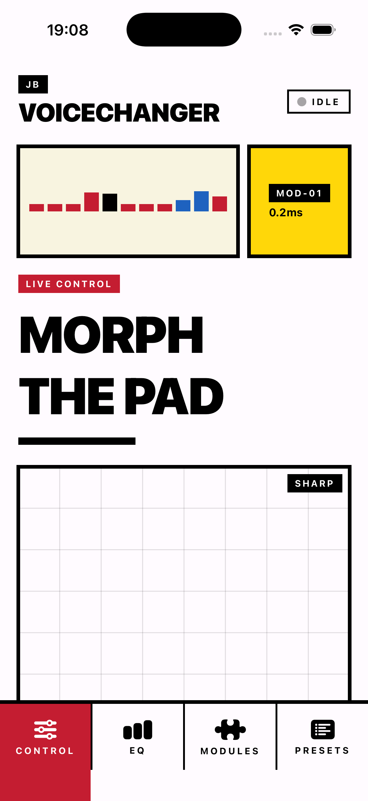

# Voice Changer Pro — iOS

**A low-latency iOS voice changer with formant-preserving pitch shift, time stretch, an XY morphing pad, and real-time spectrum / waveform / spectrogram visualisations. Built on AVAudioEngine with FFT via the Accelerate framework.**

<p align="center">
  
</p>

The starting point was: what does a serious DSP pipeline look like inside a SwiftUI app, with all the processing in-process and no cloud round-trip? Voice transformation turned out to be a useful forcing function — it's hard enough that the shortcuts show up immediately.

## Stack

- **Swift 5.9** · **SwiftUI** · iOS 17+
- **AVAudioEngine** for the realtime audio graph (input → pitch → EQ → effects → reverb → output)
- **Accelerate / vDSP** for FFT, spectral analysis, fundamental-frequency estimation
- **Rubber Band** (Phase 1B) and **[Signalsmith Stretch](https://github.com/Signalsmith-Audio/signalsmith-stretch)** (Phase 2, behind `VCP_USE_SIGNALSMITH` toggle) as alternative pitch-shift backends — Signalsmith is the longer-term pick, currently being calibrated for preset stability
- **AVAudioSession** routing + microphone permission

## What's in it

- Pitch shift (±12 semitones) with formant preservation
- Formant shift (0.5×–2.0×) for character voice effects
- Time stretch (0.5×–2.0×) decoupled from pitch via granular synthesis
- 3-band EQ, convolution reverb, ring modulator, tremolo, bit-crush
- XY morph pad mapping two parameters into one gesture
- Live visualisations: waveform, spectrum (with peak-pick fundamental estimation), spectrogram
- Preset system (Natural, Child, Elderly, Robot, Alien, Monster)

## Honest state

**Working** — the AVAudioEngine graph runs, the Rubber Band backend is stable, visualisations are real-time, Bauhaus UI ships in [`c29dcc1`](https://github.com/FromArkZoo/VoiceChangerPro-iOS/commit/c29dcc1).

**In flight** — the Signalsmith Stretch swap compiled and ran on-device (2026-05-07), but in user testing some presets came back silent. A defensive fix (DSP state reset + NaN clamp on the output path) shipped and is awaiting retest.

**Not yet shipped to the App Store.** Privacy manifest and the production app icon are still outstanding. Build settings target sideload + TestFlight today.

## Build

```bash
open VoiceChangerPro.xcodeproj
```

Set your development team in Signing & Capabilities. Run on a real device — microphone capture in the simulator is unreliable for DSP testing.

## Why a native port

The web version uses Web Audio worklets and works well in Chrome, but iOS Safari's Web Audio implementation has higher buffer latencies and no `AudioWorkletNode` parity, which made the morph-pad feel laggy and the pitch artefacts more pronounced. Going native let me drop into vDSP directly and pre-allocate buffers in the audio thread.

## License

MIT
